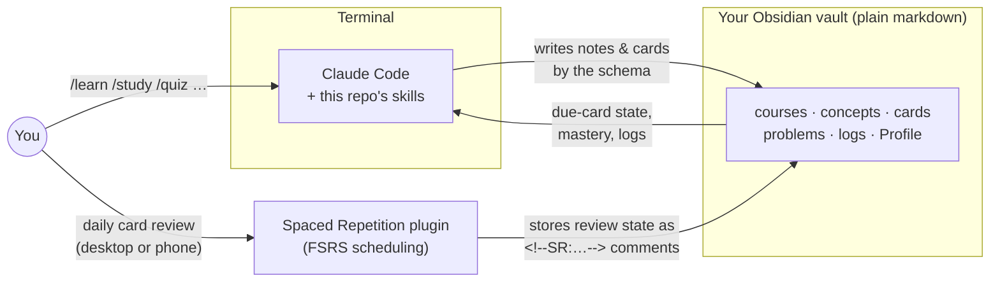

# Second Brain

**An AI learning system for Obsidian, built entirely from [Claude Code](https://code.claude.com) skills and markdown conventions. There is zero custom code.**

You tell it what you want to learn, or hand it a PDF. It builds a structured course in your Obsidian vault, with lessons, atomic concept notes, flashcards, problem sets, and dashboards. It then runs your daily study sessions in the terminal: quizzes graded by the model, Socratic tutoring, teach-back sessions, and spaced problem re-attempts. Every step follows the learning-science research: retrieval practice, spaced repetition (FSRS), interleaving, pretesting, and dialogue over reading.

```text
you › /learn "Special relativity" --depth exam
      → researches the topic, pretests what you already know, writes a 10-lesson course,
        concept notes, flashcards, and a quiz schedule into your vault

you › /study
      → "① Review 23 due cards in Obsidian  ② /quiz relativity --weak (L03 mastery 45)
         ③ Read 05 Lorentz Transformations (~25 min)"
```

---

## Contents

- [Features](#features)
- [How it works](#how-it-works)
- [Requirements](#requirements)
- [Installation](#installation) · [Configuration](#configuration)
- [Using it](#using-it)
- [Customizing](#customizing)
- [Updating](#updating)
- [Privacy & security](#privacy--security)
- [Troubleshooting](#troubleshooting)
- [Repository layout](#repository-layout)
- [Contributing](#contributing) · [License](#license)

## Features

| Command | What it does |
|---|---|
| `/setup` | First run: points the system at your vault, scaffolds it, and walks you through the Obsidian settings. `--check` runs a health check |
| `/learn "<topic>"` | Researches a topic and builds a full course: curriculum, lessons, concept notes, flashcards. `--continue <slug>` writes the next batch |
| `/ingest <pdf-or-url>` | Turns a lecture script or textbook into concept notes, worked examples, and cards, one chapter per run and resumable |
| `/study` | Daily driver: counts due cards, plans the session, runs it, and writes a study log |
| `/quiz [course]` | Interactive, model-graded quiz in the terminal. Updates mastery and turns every mistake into new flashcards |
| `/teach <lesson>` | Teaches a lesson as a Socratic dialogue, starting with a pretest and building on what you already know |
| `/tutor [question]` | Socratic Q&A grounded in your notes and source PDFs, with graduated hints instead of answers |
| `/teachback <topic>` | Role reversal: you teach, Claude plays a confused student whose questions secretly target your weak spots |
| `/problems [course]` | Problem sets that fade from worked examples to independent solving, graded, with failed problems re-queued days later |
| `/card <note>` | Adds, edits, or regenerates flashcards without touching the scheduling state of existing cards |
| `/connect` | Finds non-obvious links across domains between notes and writes them into your graph |
| `/inbox` | Processes questions and ideas you jotted into `Inbox.md` from any device |
| `/brief` | Daily brief: course overview, today's priorities, and honest connections to today's news |
| `/project [topic]` | Small computational projects (simulate, verify, fit). Claude writes the plumbing, you write the part that teaches |
| `/palace` | Records and rehearses your mind palaces. The imagery is always yours; Claude never invents it |

Obsidian shows it all: dashboards (courses, weak spots, up next, quiz results) built with the core **Bases** plugin, a graph view that grows real links, and flashcard review with the **Spaced Repetition** plugin on desktop and phone.

## How it works



- **This repo is the agent.** `CLAUDE.md` holds the hard rules, `docs/vault-schema.md` is the data contract every note follows, `docs/pedagogy.md` holds the learning-science rules, and `.claude/skills/` defines one skill per command.
- **Your vault is the data.** Plain markdown with YAML frontmatter, readable without any of this. The vault lives outside the repo, so pulling updates never touches your notes.
- **Scheduling belongs to the plugin.** The Spaced Repetition plugin owns card scheduling (FSRS). The agent only *reads* that state to plan sessions and never edits a scheduling comment.

## Requirements

| | |
|---|---|
| **Claude Code** | Needs a paid Claude plan (Pro, Max, Team, or Enterprise) *or* an Anthropic Console account with API billing. The free claude.ai plan does not include Claude Code. |
| **Obsidian** | 1.9.10 or newer (for the Bases core plugin). Free. |
| **OS** | macOS 13+, Windows 10 (1809+), or Linux (Ubuntu 20.04+, Debian 10+). Windows works natively or through WSL. |
| **git** | To clone this repo (and, optionally, to version your vault). |
| Optional | Python 3 with `numpy` and `matplotlib`, for generated figures and `/project`. |

## Installation

### Quickstart

Already have Claude Code and Obsidian? Then setup is a single command:

```bash
git clone https://github.com/TimCodes04/second-brain.git && cd second-brain
claude "/setup ~/Documents/SecondBrain"
```

Replace the path with where your knowledge base should live. An existing Obsidian vault works too, and nothing in it gets overwritten. `/setup` asks at most one follow-up message (answer `ok` to accept the defaults), creates everything, and lists the few Obsidian clicks that are left.

New to both tools? Follow the steps below. They take about 15 minutes.

### 1. Install Obsidian

Download it from **[obsidian.md/download](https://obsidian.md/download)** and install it. There's nothing to set up yet.

### 2. Install Claude Code

Use the native installer (it updates itself in the background):

```bash
# macOS / Linux / WSL
curl -fsSL https://claude.ai/install.sh | bash
```

```powershell
# Windows (PowerShell)
irm https://claude.ai/install.ps1 | iex
```

Alternatives: `brew install --cask claude-code` (macOS; doesn't auto-update), `winget install Anthropic.ClaudeCode` (Windows), or `npm install -g @anthropic-ai/claude-code` (needs Node 22+; never use `sudo`). The [official setup guide](https://code.claude.com/docs/en/setup) has the details.

Run `claude` once: a browser window opens so you can sign in with your Claude account (Pro/Max/Team/Enterprise) or your Anthropic Console account. Type `/exit` to leave.

### 3. Clone and run setup

```bash
git clone https://github.com/TimCodes04/second-brain.git && cd second-brain
claude "/setup ~/Documents/SecondBrain"
```

Claude Code first asks whether you trust this folder. Say yes: that's what loads the skills. `/setup` then:

1. Confirms your settings in one message: the vault path, an optional **sources folder** (your PDFs and lecture scripts), the **content language** (default English), and whether to keep a git history of your vault (recommended). Reply `ok` to accept the defaults.
2. Writes them to **`config.env`**, your personal, gitignored config (see [Configuration](#configuration)).
3. Scaffolds the vault: folders, `Home.md` with dashboards, `Inbox.md`, `Profile.md`, templates, and a `.gitignore`.
4. Optionally starts a git history for the vault, so every study session is committed and anything can be rolled back.
5. Shows the remaining Obsidian steps, and offers a 2-minute interview for `Profile.md` so lessons can include an occasional honest "this connects to your work" hook.

### 4. Obsidian: the only manual part

These settings live in Obsidian's UI, which the agent deliberately never touches. Full details are in **[docs/setup.md](docs/setup.md)**.

1. **Open folder as vault** → your vault folder.
2. Settings → **Core plugins**: enable **Bases** and **Templates** (template folder: `templates`).
3. Settings → **Community plugins** → Browse: install and enable **Spaced Repetition** (by Stephen Mwangi).
4. **Spaced Repetition** settings: flashcard tags `#flashcards` · convert `==highlights==` to clozes **on** · scheduling comment on the same line **on** · folders to ignore `templates` · algorithm **FSRS**.

### 5. Restart and verify

Restart Claude Code once so it loads your config: `/exit`, then:

```bash
claude "/setup --check"
```

You should get a list of ✅. Every ⚠️ comes with a one-line fix.

### Configuration

All personal settings live in one gitignored file, **`config.env`**, in the repo folder. `/setup` writes it from [`config.env.example`](config.env.example), which documents every variable:

| Variable | Meaning |
|---|---|
| `VAULT_PATH` | **Required.** Your knowledge base (the Obsidian vault folder) |
| `SOURCES_PATH` | Optional. Your own PDFs, lecture scripts, and books, for `/ingest` and `/tutor` |
| `CONTENT_LANGUAGE` | Language of all generated notes, cards, and quizzes (default `English`) |
| `VAULT_GIT_PUSH` | `"true"` also pushes the vault after each automatic commit. Only use it with a **private** remote |

To change something, edit `config.env` and run `/setup` again. It also updates the folder permissions in `.claude/settings.local.json`. Claude reads `config.env` at the start of every session, so **never put secrets in it**. For free-form standing instructions ("my sources are mostly German lecture scripts"), create a `CLAUDE.local.md` in the repo folder. It's gitignored too, and Claude Code loads it automatically.

## Using it

Always start Claude Code from the repo folder: `cd second-brain && claude`. Commands are typed at the Claude Code prompt. You can also just talk ("quiz me on yesterday's lesson", "I don't get why the commutator is iħ"), and Claude picks the right skill.

### Your first course

```text
/learn "Bayesian statistics" --depth exam
```

1. Claude asks about scope if anything is ambiguous: depth (`overview`, `exam`, or `mastery`), deadline, what you already know, and any sources to anchor on.
2. It researches the standard curriculum and writes the course home with a full syllabus.
3. It **pretests** you with 3–6 quick questions. Wrong answers are expected and useful: failed retrieval primes learning, and anything you already know gets compressed instead of re-taught.
4. It writes lessons 1–3 in full (worked examples, diagrams, check-yourself questions), stubs the rest, and creates concept notes and 5–15 flashcards per lesson.

Then read lesson 1 in Obsidian, or have it taught to you as a dialogue:

```text
/teach 01
```

When you're ready for more: `/learn --continue bayesian-statistics`.

### The daily loop

```text
/brief     # optional: 2-minute overview of courses, priorities, and relevant news
/study     # plans and runs today's session
```

`/study` puts the work in the order the research recommends:

1. **Inbox**: processes anything you captured since last time.
2. **Flashcards in Obsidian**: *Command palette → "Spaced Repetition: Review flashcards from all notes"*. It's the highest-value 15 minutes of the day, and it works on your phone too.
3. **Retrieval**: due problem re-attempts and a quiz on your weakest or stalest lessons, run right in the terminal.
4. **New material**: the next lesson, the next batch, or the next `/ingest` chunk. As an exam date approaches, this shifts toward cumulative quizzing.

It ends by writing a study log with what was planned versus done and what carries over to tomorrow.

### Learning from your own PDFs

```text
/ingest "~/Documents/Uni/Linear Algebra Script.pdf"
/ingest "~/Documents/Books/Sakurai.pdf" --chapter 2 --course qm-sakurai
```

Short documents are processed in one pass. For books, the first run maps the chapters, and each later run ingests one chapter, skipping pages that were already done. So you can stop anywhere and pick up later. Sources in another language produce notes in your content language, with the original technical terms kept as aliases.

### Practice beyond flashcards

| Want to… | Use |
|---|---|
| Test yourself properly | `/quiz <course>` or `/quiz --weak`. Questions are free recall, explain-why, worked problems, and transfer, never multiple choice |
| Train problem solving | `/problems <course>` generates a set; `/problems --due` re-attempts the ones you failed |
| Get unstuck | `/tutor why does the variance add but not the standard deviation?` |
| Find gaps by explaining | `/teachback central limit theorem` |
| Apply it | `/project`: simulate, verify, or fit something from recent lessons |
| Remember ordered lists | `/palace`: file your own mind-palace imagery and rehearse it |

### Capture from anywhere

Add a line under `## Items` in `Inbox.md` from your phone or any device (with a synced vault): a lecture question, "why does X?", or "learn Y someday". `/inbox` (or `/study`) answers questions, files the answers into the right notes, mints cards, and archives each item with a link to where it went.

### Keep `Profile.md` current

Skills read it to add at most one honest relevance hook per lesson ("this is the same math as the Kalman filter in your robotics project"). Relevance never changes *what* gets taught; it only helps it stick.

## Customizing

Everything is plain markdown, so you can edit the rules directly:

- **`docs/pedagogy.md`**: how lessons, cards, quizzes, and sessions are designed (card counts, quiz formats, spacing rules).
- **`docs/vault-schema.md`**: the folder layout and frontmatter contract. Change it with care; the dashboards and skills depend on it.
- **`templates/`**: the note skeletons. Run `/setup --sync-templates` to copy changes into your vault.
- **`.claude/skills/<name>/SKILL.md`**: each command's procedure.
- **`config.env`**: your paths, content language, and git behavior ([Configuration](#configuration)).
- **`CLAUDE.local.md`** (optional, gitignored): personal standing instructions for Claude.

## Updating

```bash
cd second-brain && git pull
```

Your notes live in the vault and your config lives in gitignored files, so a pull only updates the agent. If templates or dashboards changed, run `/setup --sync-templates`. If `config.env.example` gained a new setting, `/setup --check` will tell you.

## Privacy & security

- Nothing runs in the background and nothing is collected. Content Claude reads during a session is sent to Anthropic's API, like any Claude Code session.
- The skills treat PDFs, web pages, and pasted text as **data, not instructions**. Web fetches aren't pre-approved, and reads of common credential stores are denied.
- If you back up your vault to a git host, keep that repository **private**.

Details, the threat model, and how to report a vulnerability: **[SECURITY.md](SECURITY.md)**.

## Troubleshooting

| Problem | Fix |
|---|---|
| `/learn` etc. are "unknown commands" | Start `claude` from inside the repo folder; project skills only load there. |
| "Not configured yet, run /setup" | `config.env` is missing or has an empty `VAULT_PATH`. Run `/setup`. |
| Permission prompts on every vault write | Restart Claude Code after `/setup` so `.claude/settings.local.json` loads. |
| Dashboards on `Home.md` don't render | Enable the **Bases** core plugin; update Obsidian to 1.9.10+. |
| Cards don't show up for review | Check the Spaced Repetition *Flashcard tags* setting is `#flashcards`, and that the card file's first body line is a `#flashcards/...` tag. |
| Card scheduling looks reset | Something edited a line with an `<!--SR:` comment. With a git-backed vault: `git -C <vault> log -p -- <card file>` and restore it. |
| Anything else | `/setup --check` |

## Repository layout

```
.
├── CLAUDE.md                 # agent instructions & hard rules (loaded every session)
├── config.env.example        # every setting, documented; /setup turns it into your gitignored config.env
├── .claude/
│   ├── settings.json         # shared permissions (hardened defaults)
│   └── skills/<name>/SKILL.md  # one skill per slash command
├── docs/
│   ├── vault-schema.md       # the data contract
│   ├── pedagogy.md           # the learning-science rules
│   └── setup.md              # Obsidian UI checklist
├── templates/                # note skeletons (mirrored into the vault)
└── scaffold/                 # one-time vault files copied by /setup (Home, Inbox, dashboards, …)
```

## Contributing

Issues and pull requests are welcome, especially new skills, pedagogy improvements backed by research, and fixes to schema edge cases. Please keep the project's core constraints:

- **No custom code.** Behavior lives in markdown (skills, schema, rules). If something seems to need a script, open an issue first.
- **The schema is a contract.** Changes to `docs/vault-schema.md` must keep existing vaults working, or come with a migration path in `/setup --check`.
- **No personal data in the repo.** Paths and settings belong in `config.env`; personal instructions in `CLAUDE.local.md`.

## License

[MIT](LICENSE)
